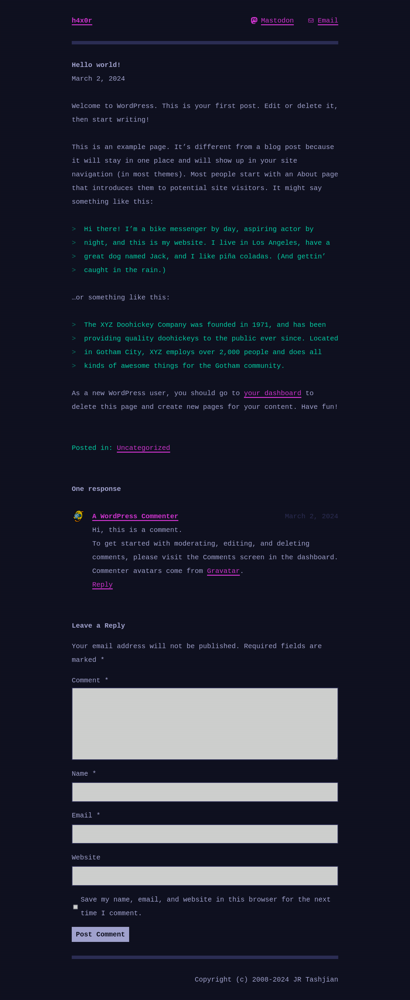
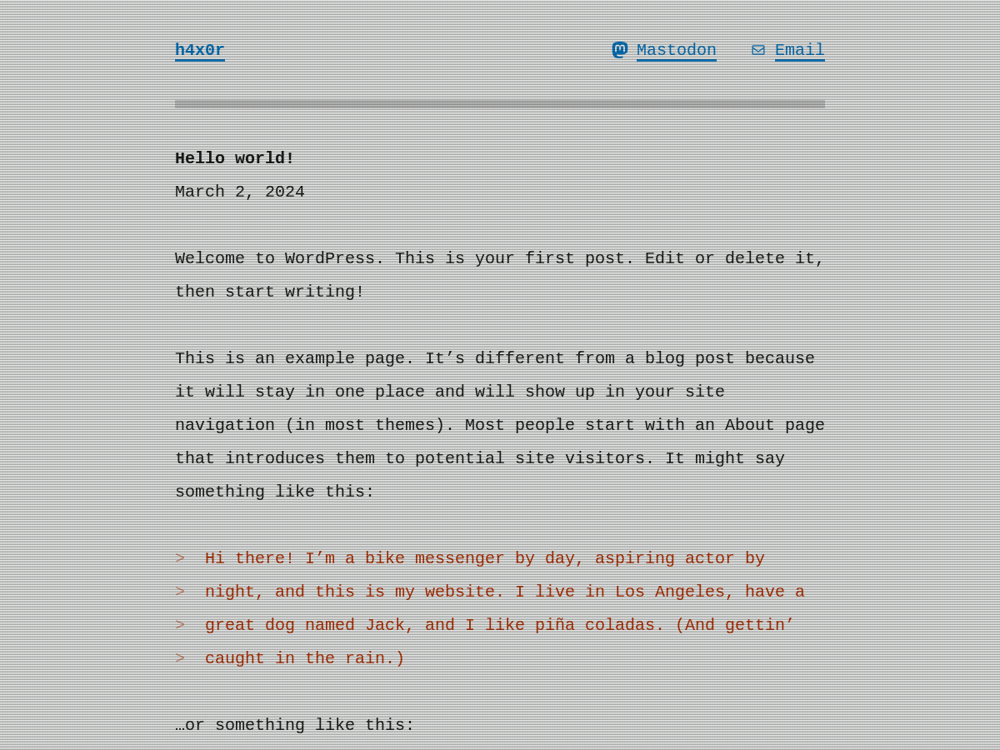
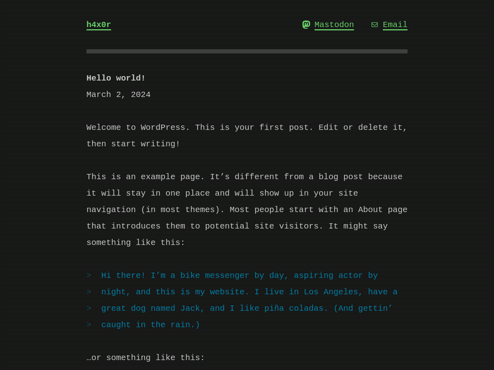
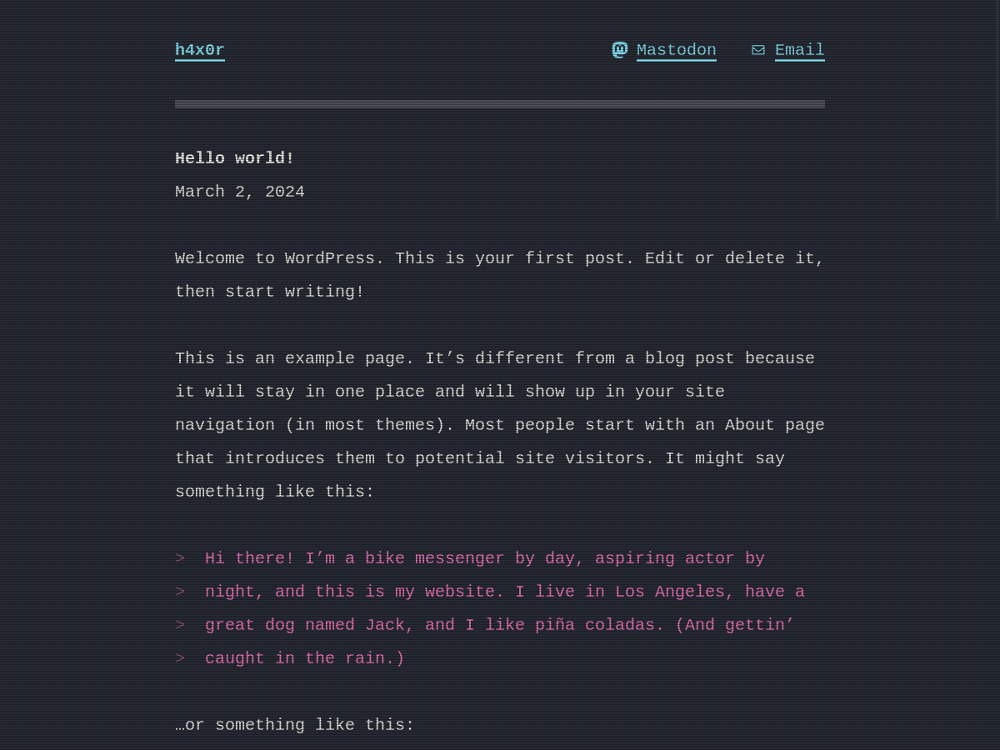
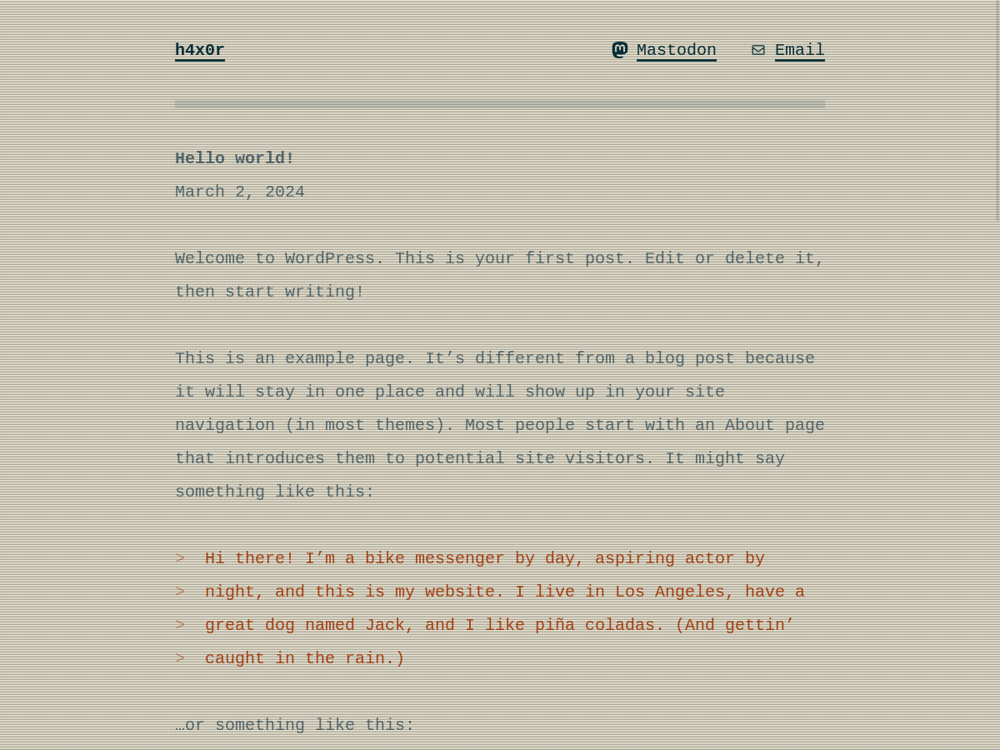
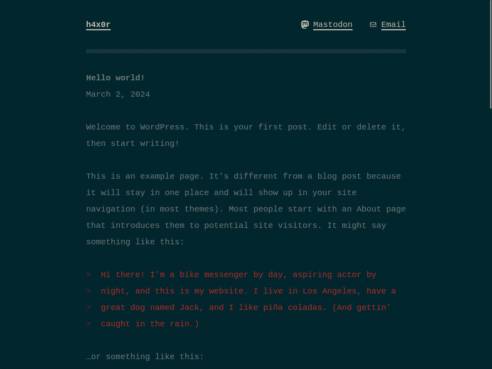

# h4x0r

This is a personal theme I created for my [personal website](https://jrtashjian.com).

It is a terminal styled theme with a CRT screen effect and provides multiple color themes: [Cyberpunk](#cyberpunk), [Default Light](#default-light), [Default Dark](#default-dark), [Dracula](#dracula), [Solarized Light](#solarized-light), and [Solarized Dark](#solarized-dark).

### Cyberpunk

### Default Light

### Default Dark

### Dracula

### Solarized Light

### Solarized Dark

